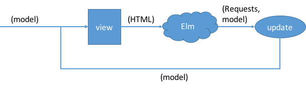

#  CSCI 1103 Computer Science 1 Honors

## Fall 2020

Robert Muller - Boston College

---

## DRAFT Lecture Notes
## Week 5

**Topics:**

1. Problem Set 4: The Best Candidate Algorithm
2. More on Repetitive Algorithms: Insertion Sort
3. The Missing third built-in Sum Type: `'a option`
4. More on Repetitive Algorithms: Primality & Factoring, One-way Functions
5. Still More on Repetitive Algorithms: The Bisection Algorithm for Approximating the Square Root

---

### 1. Problem Set 4: The Best Candidate Algorithm

Mitchell's best candidate algorithm is described by Mike Bostock in his [Visualizing Algorithms](https://bost.ocks.org/mike/algorithms/?utm_source=ifttt) blogpost.

#### Model-View-Update

Most software applications interact with a  user in one way or another. For example, an item can be purchased via a website, or a user can distribute a tweet by filling fields with typed text and/or selecting various buttons. In these cases, the applications are web applications. The applications maintain some internal representation of the interaction with the user, this internal representation is often called a *model*.  When an event occurs such as a clock tick or the user enters some text or selects a button, the model is *updated* to reflect the occurrence of the event. In order for the application to keep the user up to date with accurate information, the applications display a graphical depiction or *view* of the model using the web document markup language HTML. Maybe the sale has been completed or the tweet has been sent.

The [model-view-update](https://guide.elm-lang.org/architecture/) application design (sometimes called a "software architecture" or sometimes a "software pattern") has been popularized by [Evan Czaplicki](https://github.com/evancz) the creator of the [Elm](https://elm-lang.org/) dialect of ML. It refers to a particular way of having data flow *one way* through interactive applications:



The above design turns out to be remarkably general for user interfaces (UIs). It is the basis of the most widely used system for modern web applications: JavaScript's [React](https://reactjs.org/) library/framework.

In CSCI 1103, we're using the model-view-update UI design locally on our computers. We're using the `Animate` library's `start` function, i.e., `Animate.start` which provides support for threading a model through the view and update cycles.

> Heads up! In React and Elm an application typically has just one `update` function that fields all different types of events. The events received by that `update` function are packaged up as "requests" of various kinds. The `Animate.start` function is a little more basic and doesn't have a way of expressing arbitrary requests. Thus the `update` function used with `Animate.start` is broken up into four different fixed update functions: one for clock ticks, one for mouse movements etc.
>
> ```ocaml
> 1. onTick
> 2. onMouse
> 3. onKeyPress
> 4. onKeyRelease     
> ```

Further background reading for this section can be found in the Animation section of the [Animation Notes](https://github.com/BC-CSCI1103/f17/blob/master/resources/libraries/animate/README.md). In the `src/` folder, you'll find the following `stopNgo` app.

```ocaml
(* file: stopNGo.ml
   author: Bob Muller

   CS1103 Computer Science 1 Honors

   A basic animation function stopping a ball moving left to right.
   When the touchpad is released, the ball stops or restarts.
*)
let displayHeight = 800.
let displayWidth = displayHeight
let delta = 2.
let radius = 100.
let circle = Image.circle radius Color.red
let y = displayHeight /. 2.0 -. radius

let backGround = Image.rectangle displayWidth displayHeight Color.dodgerBlue

type state = Stop | Go

(* toggle : state -> state *)
let toggle state =
  match state with
  | Stop -> Go
  | Go   -> Stop

type model = { state : state
             ; x : float
             }

(* view : model -> Image.t *)
let view model = Image.place_image circle (model.x, y) backGround

(* update : model -> model *)
let update model =
  match model.state with
  | Go -> { model with x = model.x +. delta }
  | Stop -> model

let initialModel = { state = Go
                   ; x = -. radius
                   }

let handleMouse model x y event =
  match event = "button_up" with
  | true  -> { model with state = toggle model.state }
  | false -> model

let go () =
  Animate.start initialModel
    ~name: "stopNgo"
    ~width: displayWidth
    ~height: displayHeight
    ~rate: 0.01
    ~view: view
    ~onTick: update
    ~onMouse: handleMouse

let s = go ()
```

---

### 2. More on Repetitive Algorithms: Insertion Sort

FINISH WRITING THIS UP.

With the `insert` function from problem set 3:

```ocaml
(* insert : 'a -> 'a list -> 'a list *)
let rec insert x xs =
  match xs with
  | [] -> [x]
  | y :: ys ->
    (match x > y with
     | true  -> x :: xs
     | false -> y :: insert x ys)
```

We can *sort* the items in an input list:

```ocaml
(* insertionSort : 'a list -> 'a list

   A few notes:
   1. The proposition: "result is descending" is invariant wrt repeat;
   2. insertionSort is quadratic in the worst case;
   3. insertionSort is linear in the best case. (!) *)
let insertionSort ns =
  let rec repeat ms result =
    match ms with
    | [] -> result
    | q :: qs -> repeat qs (insert q result)
  in
  repeat ns []
```

This algorithm is quadratic in the length of the input list.

### 3. The Missing third built-in Sum Type `'a option`

Programming languages featuring sum types usually include a built-in sum type for handling exceptional situations in code where an expression of one kind or another might not yield a value. In OCaml, this built-in type is named *option*, in other languages the type is named *maybe*. We'll illustrate the usage of the option type with two examples.

The `option` type is defined as

```ocaml
type 'a option = None
               | Some of 'a
```

There are two variants `None` and `Some`. The occurrence of the type variable `'a` in the definition means that options are polymorphic, they can be used with any type.

```ocaml
# None;;
- : 'a option = None

# Some (3 * 4);;
- : int option = Some 12

# let maybe = Some ("Hello", false);;
val maybe : (string * bool) option = Some ("Hello", false)
```

The Standard Library function `Option.get : 'a option -> 'a` can be used to retrieve a value wrapped in a `Some`.

```ocaml
# Option.get (Some 12);;
- : int = 12

# Option.get maybe;;
- : string * bool = ("Hello", false)
```

It's more common and usually better style to retrieve the value wrapped in a `Some` by using pattern matching. We'll see this in the examples below.

##### Example 1: Handling Division by Zero

Consider integer division `m / n`. If the divisor `n` is zero, there is no quotient.

```ocaml
# 2 / 0;;
Exception: Division_by_zero.
```

At execution-time, the built-in integer division operator `/` throws a `Division_by_zero` [exception](https://en.wikipedia.org/wiki/Exception_handling). An exception is an alternative form for managing unusual events arising during the execution of a program. Exceptions are a common feature of modern programming languages. We'll circle back to them later. For now, we'd like to consider dealing with the exceptional condition using the option type.

```ocaml
(* carefulDivide : int -> int -> int option
*)
let carefulDivide m n =
  match n = 0 with
  | true  -> None
  | false -> Some (m / n)
```

Code calling the `carefulDivide` function must deal with both the absence of a quotient and the presence of a quotient.

```ocaml
(* f : int -> int -> int
*)
let f m n =
  match (carefulDivide m n) with
  | None -> ... do something ... return an int ...
  | Some quotient -> quotient
```

If our code fails to deal with both variants of the option, the OCaml compiler (and Merlin) will issue a warning.

---
### 4. Primality & Factoring; One-way functions

FINISH WRITING THIS SECTION

#### Primality Testing

```ocaml
isFactor : int -> int -> bool *)
let isFactor m n = n mod m = 0

(* isPrime : int -> bool *)
let isPrime n =
  let top = int_of_float(sqrt(float n)) in
  let rec repeat i =
    match i > top with
    | true  -> true
    | false ->
      (match isFactor i n with
       | true  -> false
       | false -> repeat (i + 1))
  in
  repeat 2
```

#### Multiplying and Factoring

```ocaml
(* Multiplying and Factoring --- the former is "easy", the latter is "hard".
   NB: A proper factor of N is a factor of N other than 1 or N. *)

(* multiply : int * int -> int *)
let multiply (m, n) = m * n

(* Finding factors: find the minimum proper factor and its co-factor. This is
   hard. If n is the product of 2 prime numbers, there are only two proper
   factors. How to compute them? We have to root around looking for them!

   searchForFactors : int -> (int * int) option *)
let searchForFactors n =
  let top = int_of_float(sqrt(float n)) in
  let rec loop i =
    match i > top with
    | true  -> None
    | false ->
      (match isFactor i n with
       | true  -> Some (i, n / i)
       | false -> loop (i + 1))
  in
  loop 2
```

---

### 5. The Bisection Algorithing for Approximating the Square Root

FINISH WRITING THIS UP.

```ocaml
(* sqrt : float -> int -> float option
 *
 * The call (sqrt x n) will return an (option of) approximation
 * of the square root of x such that the square of the result is within
 * epsilon of x. The algorithm computes approximations iteratively and
 * returns None if it cannot compute the approximation within n iterations.
*)
let sqrt ?n:(n=50) x =
  let rec iterate i lo hi =
    match i > n with
    | true  -> None
    | false ->
      let guess = (lo +. hi) /. 2.0 in
      let guessSquared = guess ** 2.0 in
      let error = abs_float(x -. guessSquared) in
      let _ = show i lo hi guess error
      in
      match Lib.closeEnough guessSquared x with
      | true -> Some guess
      | false ->
        (match guessSquared < x with
                     | true  -> iterate (i + 1) guess hi
                     | false -> iterate (i + 1) lo guess)
  in
  iterate 1 0.0 x
```
A call such as

```ocaml
sqrt 2.0 ~n:25;;
```
would trace as:
```bash
try=1: lo=0.0000000000, hi=2.0000000000, guess=1.0000000000, error=1.0000000000
try=2: lo=1.0000000000, hi=2.0000000000, guess=1.5000000000, error=0.2500000000
try=3: lo=1.0000000000, hi=1.5000000000, guess=1.2500000000, error=0.4375000000
try=4: lo=1.2500000000, hi=1.5000000000, guess=1.3750000000, error=0.1093750000
try=5: lo=1.3750000000, hi=1.5000000000, guess=1.4375000000, error=0.0664062500
try=6: lo=1.3750000000, hi=1.4375000000, guess=1.4062500000, error=0.0224609375
try=7: lo=1.4062500000, hi=1.4375000000, guess=1.4218750000, error=0.0217285156
try=8: lo=1.4062500000, hi=1.4218750000, guess=1.4140625000, error=0.0004272461
try=9: lo=1.4140625000, hi=1.4218750000, guess=1.4179687500, error=0.0106353760
try=10: lo=1.4140625000, hi=1.4179687500, guess=1.4160156250, error=0.0051002502
try=11: lo=1.4140625000, hi=1.4160156250, guess=1.4150390625, error=0.0023355484
try=12: lo=1.4140625000, hi=1.4150390625, guess=1.4145507812, error=0.0009539127
try=13: lo=1.4140625000, hi=1.4145507812, guess=1.4143066406, error=0.0002632737
try=14: lo=1.4140625000, hi=1.4143066406, guess=1.4141845703, error=0.0000820011
try=15: lo=1.4141845703, hi=1.4143066406, guess=1.4142456055, error=0.0000906326
try=16: lo=1.4141845703, hi=1.4142456055, guess=1.4142150879, error=0.0000043148
try=17: lo=1.4141845703, hi=1.4142150879, guess=1.4141998291, error=0.0000388434
try=18: lo=1.4141998291, hi=1.4142150879, guess=1.4142074585, error=0.0000172643
try=19: lo=1.4142074585, hi=1.4142150879, guess=1.4142112732, error=0.0000064748
try=20: lo=1.4142112732, hi=1.4142150879, guess=1.4142131805, error=0.0000010800
try=21: lo=1.4142131805, hi=1.4142150879, guess=1.4142141342, error=0.0000016174
try=22: lo=1.4142131805, hi=1.4142141342, guess=1.4142136574, error=0.0000002687
```
